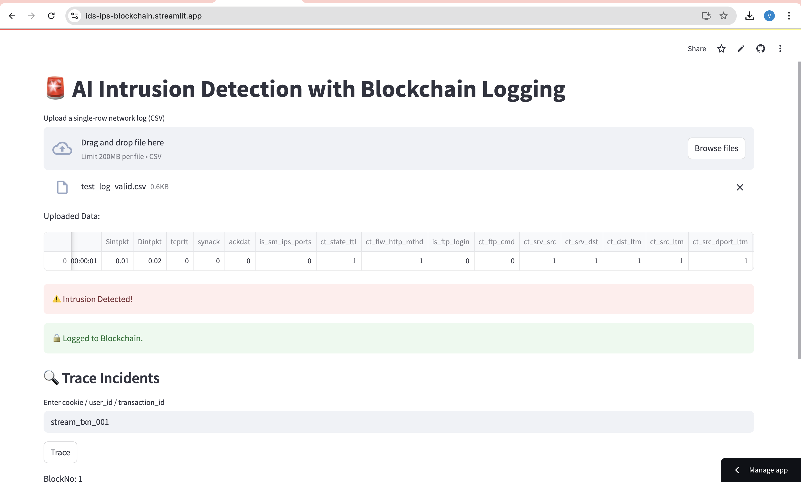
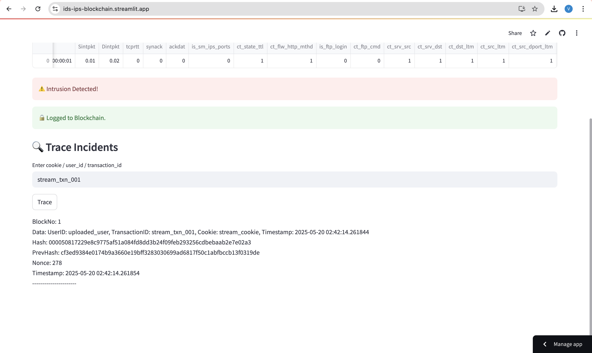

# AI + Blockchain Intrusion Detection System

This project integrates a machine learning-based Intrusion Detection System (IDS) with a blockchain-based logging mechanism using Streamlit for real-time web interaction.

👉 **[Try it](https://ids-ips-blockchain.streamlit.app/)**
## Features

- Detects intrusions using Random Forest trained on UNSW-NB15 dataset
- Logs each detected threat into a blockchain
- Allows tracing of previous incidents by user ID, transaction ID, or cookie
- Web interface built with Streamlit

## 📸 Screenshots

### 🚨 Upload and Detection Interface

This view shows the Streamlit interface where a user uploads a network log and receives an immediate intrusion detection result. If a threat is detected, it is automatically logged to the blockchain.

### 🧾 Blockchain Trace Result

After an intrusion is detected and logged, users can trace incidents using a unique identifier such as the user ID, transaction ID, or cookie. The screenshot below shows a successful trace result, displaying the full block details recorded on the blockchain.

